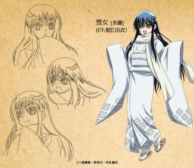

## About

《滑头鬼之孙》（ぬらりひょんの孫）改编自椎桥宽原作的同名漫画，由Studio DEEN制作。故事以现代日本为舞台，围绕拥有四分之一妖怪血统的混血儿奴良陆生展开。白天是普通中学生，夜晚则觉醒为妖怪形态，率领"奴良组"百鬼夜行，在人类与妖怪共存的世界中守护平衡与羁绊。

## Key Information

- **Episodes**: Completed 26 out of 26 episodes
- **Status**: Completed
- **Rating**: 8.0/10

## Notes

第一部以世界观搭建、奴良组登场与陆生觉醒为主线，妖怪设定丰富，战斗场面流畅，百鬼夜行的群像塑造出彩。

## 个人喜欢角色

及川冰丽（雪女）

